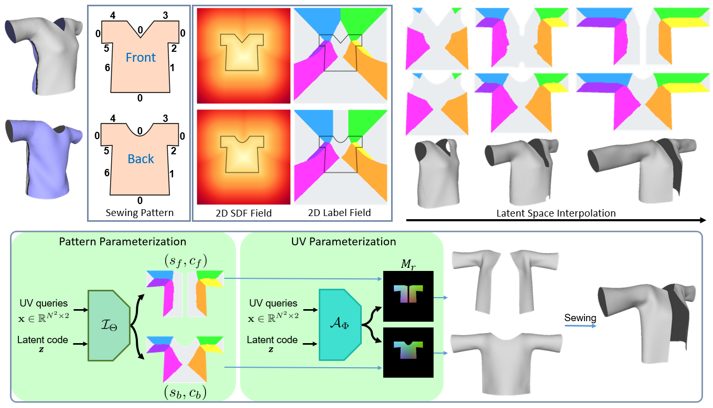

# ISP: Multi-Layered Garment Draping with Implicit Sewing Patterns
<p align="center"></p>

This is the repo for [**ISP: Multi-Layered Garment Draping with Implicit Sewing Patterns**](https://liren2515.github.io/page/isp/isp.html).

## Setup:
Download checkpoints from [here](https://drive.google.com/file/d/1Zhr93ejWGobqDnJjE-P95ssNTDYSFNXS/view?usp=sharing), and put `*.pth` at `./checkpoints`.

Download and extract the SMPL model from http://smplify.is.tue.mpg.de/ and place `basicModel_f_lbs_10_207_0_v1.0.0.pkl` in the folder of `./smpl_pytorch`.

The code is implemented with python 3.6 and torch 1.9.0+cu102 (other versions may also work).

Other dependencies include `trimesh`, `pytorch3D`, `scipy`.

## Inference
For garment generation:
```
python infer_isp.py --which tee/pants/skirt --save_path tmp --save_name skirt --res 256 --idx_G 0
```

For layering inference:
```
python infer_layering.py
```

## Fitting
For fitting ISP to 3D garment mesh in rest pose:
```
python fitting_3D_mesh.py --which tee/pants/skirt --save_path tmp --save_name skirt-fit --res 256
```

For fitting ISP to images:
```
python fitting_image.py --which skirt --save_path tmp --save_name skirt-fit --res 256
```

## Citation
If you find our work useful, please cite it as:
```
@inproceedings{Li2023isp,
  author = {Li, Ren and Guillard, Benoit and Fua, Pascal},
  title = {{ISP: Multi-Layered Garment Draping with Implicit Sewing Patterns}},
  booktitle = {Advances in Neural Information Processing Systems},
  year = {2023}
}
```
